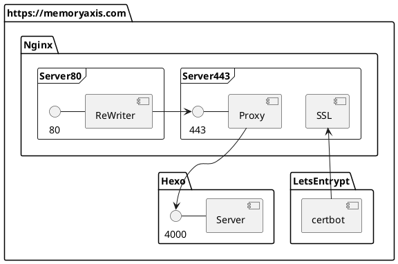

这是博客里的第一篇文章, 主要会简单介绍一下本博客使用的技术和架构. 
如果你想要搭建类似的个人主页, 可以点击相关技术打开其官方文档, 他们提供了非常全面的文档. 
在文章最后还提供一些链接, 包括一些参考和部分可能遇到问题的解决办法. 

## 技术列表:

+ [Hexo][link-hexo] (博客框架)
    + [Node.js][link-nodejs]
+ [Nginx][link-nginx] (反向代理,HTTPS)(可选)
+ [Let's Encrypt][link-letsencrypt] (免费SSL证书)(可选)

## 技术架构: 

## 其他资源:

+ 阿里云
    + 云服务器(CentOS)
    + 域名解析服务

## 参考链接:

+ Hexo
    + [Hexo DOC](https://hexo.io/docs/index.html)
    + [Hexo themes](https://hexo.io/themes/)
    + [Hexo plugins](https://hexo.io/plugins/)
+ Nginx
    + [Nginx rewrite module](http://nginx.org/en/docs/http/ngx_http_rewrite_module.html)
    + [Nginx proxy module](http://nginx.org/en/docs/http/ngx_http_proxy_module.html)
    + [在已经安装的Nginx上添加SSL模块](http://blog.csdn.net/cin_ie/article/details/72843277)
+ Let's Encrypt
    + [How to enable EPEL repository?](https://www.liquidweb.com/kb/enable-epel-repository/)
    + [Certbot DOC](https://certbot.eff.org/docs/using.html#nginx)
    + [Client with the currently selected authenticator does not support any combination of challenges that will satisfy the CA](https://community.letsencrypt.org/t/solution-client-with-the-currently-selected-authenticator-does-not-support-any-combination-of-challenges-that-will-satisfy-the-ca/49983)

[link-hexo]: https://hexo.io/
[link-nginx]: http://nginx.org/
[link-nodejs]: https://nodejs.org/en/
[link-letsencrypt]: https://letsencrypt.org/

